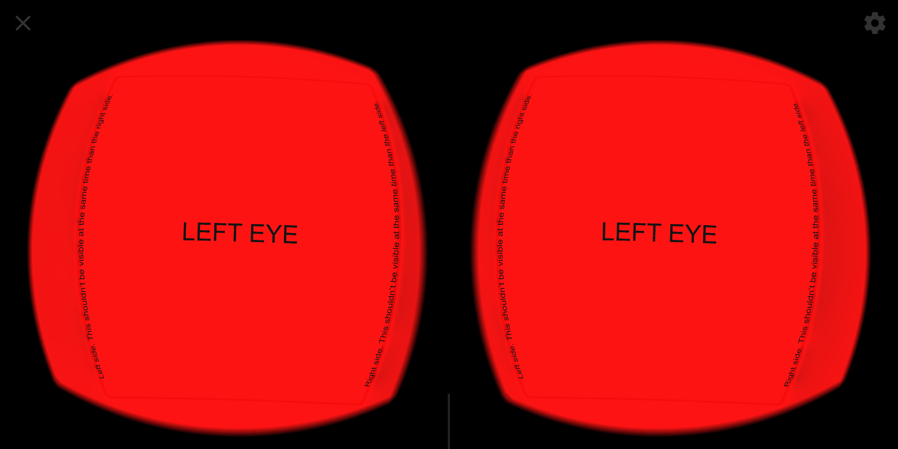
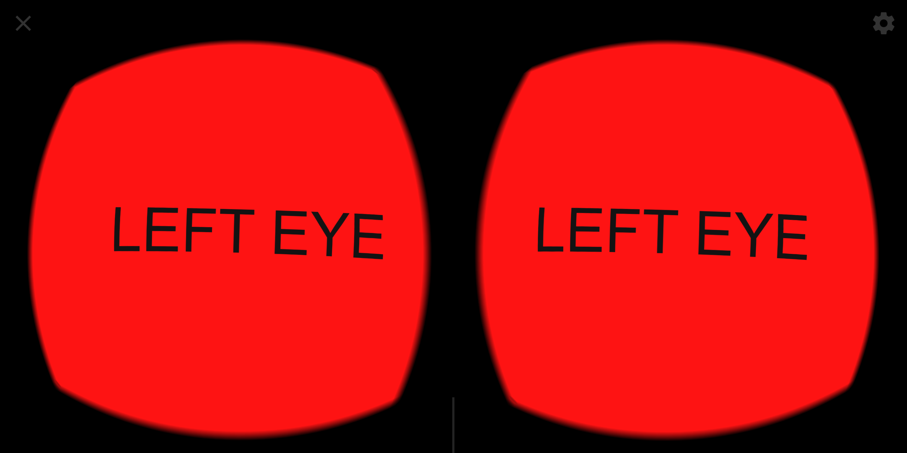
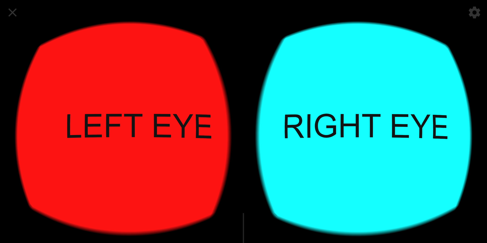

# Google Photos VR180 XMP Metadata Test

[Link to Google Support forum](https://support.google.com/photos/thread/935320?hl=en)

[Cardboard Camera VR Photo Format](https://developers.google.com/vr/reference/cardboard-camera-vr-photo-format)

Hi! These are some manually generated VR180 JPG files to show some problems that Google Photos has parsing XMP metadata. These had been tested in a Google Pixel 2 XL with Android 9 and Google Photos 4.8.0.229411315.

There are included 3 JPG files, the metadata is the same for all of them. The formatting for the basic XMP XML Metadata are different although all of them are equivalent (see [Expected behavior](#expected-behavior)). However, even being equivalent, they are handled in different ways.

The basic and extended XMP contents are also included for easier inspection as separated files _test?-basic-xmp.bin_ and _test?-ext-xmp.bin_. The extended XMP used is the same for all of them.

## test1.jpg
The basic XMP consists of 3 `<rdf:Description>` elements and the property values for `GPano`, `GImage` and `xmpNote` are subelements. `GPano` elements **ARE NOT** in the first `<rdf:Description>` element.

**PROBLEM:** Google Photos shows the same image for both eyes and the perspective is incorrect, you are able to see the left and right sides of the photo at the same time.

### Basic XMP Content
```xml
<x:xmpmeta xmlns:x='adobe:ns:meta/'>
<rdf:RDF xmlns:rdf='http://www.w3.org/1999/02/22-rdf-syntax-ns#'>

 <rdf:Description rdf:about=''
  xmlns:xmpNote='http://ns.adobe.com/xmp/note/'>
  <xmpNote:HasExtendedXMP>06A56CB0A1A7FAFDA459CA3FAA14B474</xmpNote:HasExtendedXMP>
 </rdf:Description>

 <rdf:Description rdf:about=''
  xmlns:GImage='http://ns.google.com/photos/1.0/image/'>
  <GImage:Mime>image/jpeg</GImage:Mime>
 </rdf:Description>

 <rdf:Description rdf:about=''
  xmlns:GPano='http://ns.google.com/photos/1.0/panorama/'>
  <GPano:CroppedAreaImageHeightPixels>3000</GPano:CroppedAreaImageHeightPixels>
  <GPano:CroppedAreaImageWidthPixels>3000</GPano:CroppedAreaImageWidthPixels>
  <GPano:CroppedAreaLeftPixels>750</GPano:CroppedAreaLeftPixels>
  <GPano:CroppedAreaTopPixels>0</GPano:CroppedAreaTopPixels>
  <GPano:FullPanoHeightPixels>3000</GPano:FullPanoHeightPixels>
  <GPano:FullPanoWidthPixels>6000</GPano:FullPanoWidthPixels>
  <GPano:ProjectionType>equirectangular</GPano:ProjectionType>
 </rdf:Description>
</rdf:RDF>
</x:xmpmeta>
```



## test2.jpg
As in [test1.jpg](#test1jpg), the basic XMP consists of 3 `<rdf:Description>` elements and the property values for `GPano`, `GImage` and `xmpNote` are subelements. `GPano` values **are in the first** `<rdf:Description>` element.

The perspective in this case seems to be correct, you are unable to see right and left sides at the same time.

**PROBLEM:** Google Photos shows the same image for both eyes.

### Basic XMP Content
```xml
<x:xmpmeta xmlns:x='adobe:ns:meta/'>
<rdf:RDF xmlns:rdf='http://www.w3.org/1999/02/22-rdf-syntax-ns#'>

 <rdf:Description rdf:about=''
  xmlns:GPano='http://ns.google.com/photos/1.0/panorama/'>
  <GPano:CroppedAreaImageHeightPixels>3000</GPano:CroppedAreaImageHeightPixels>
  <GPano:CroppedAreaImageWidthPixels>3000</GPano:CroppedAreaImageWidthPixels>
  <GPano:CroppedAreaLeftPixels>750</GPano:CroppedAreaLeftPixels>
  <GPano:CroppedAreaTopPixels>0</GPano:CroppedAreaTopPixels>
  <GPano:FullPanoHeightPixels>3000</GPano:FullPanoHeightPixels>
  <GPano:FullPanoWidthPixels>6000</GPano:FullPanoWidthPixels>
  <GPano:ProjectionType>equirectangular</GPano:ProjectionType>
 </rdf:Description>

 <rdf:Description rdf:about=''
  xmlns:xmpNote='http://ns.adobe.com/xmp/note/'>
  <xmpNote:HasExtendedXMP>06A56CB0A1A7FAFDA459CA3FAA14B474</xmpNote:HasExtendedXMP>
 </rdf:Description>

 <rdf:Description rdf:about=''
  xmlns:GImage='http://ns.google.com/photos/1.0/image/'>
  <GImage:Mime>image/jpeg</GImage:Mime>
 </rdf:Description>

</rdf:RDF>
</x:xmpmeta>
```


## test3.jpg
The basic XMP consists of just one <rdf:Description> element. The property values for `GPano`, `GImage` and `xmpNote` are serialized as attributes of the `<rdf:Description>` element, not as subelements. This form of serialization is optional, not mandatory (see [Expected Behavior](#expected-behavior)).

**This case works perfectly.**

### Basic XMP Content
```xml
<x:xmpmeta xmlns:x='adobe:ns:meta/'>
<rdf:RDF xmlns:rdf='http://www.w3.org/1999/02/22-rdf-syntax-ns#'>
 <rdf:Description rdf:about=''
  xmlns:GPano='http://ns.google.com/photos/1.0/panorama/'
  xmlns:xmpNote='http://ns.adobe.com/xmp/note/'
  xmlns:GImage='http://ns.google.com/photos/1.0/image/'
  GPano:CroppedAreaImageHeightPixels='3000'
  GPano:CroppedAreaImageWidthPixels='3000'
  GPano:CroppedAreaLeftPixels='750'
  GPano:CroppedAreaTopPixels='0'
  GPano:FullPanoHeightPixels='3000'
  GPano:FullPanoWidthPixels='6000'
  GPano:ProjectionType='equirectangular'
  xmpNote:HasExtendedXMP='06A56CB0A1A7FAFDA459CA3FAA14B474'
  GImage:Mime='image/jpeg' />
</rdf:RDF>
</x:xmpmeta>
```


# Expected behavior
The three files should be 100% equivalent and all of them should be displayed exactly in the same way in the Google Photos application.

As stated in [XMP Specification Part 1](https://wwwimages2.adobe.com/content/dam/acom/en/devnet/xmp/pdfs/XMP%20SDK%20Release%20cc-2016-08/XMPSpecificationPart1.pdf)

> #### Section 7.4: `rdf:RDF`and `rdf:Description`elements
>The **rdf:RDF** element content shall consist of only **zero or more** `rdf:Description` elements.
>
>The element content of top-level `rdf:Description` elements shall consist of zero or more XML elements for 
XMP properties. **XMP properties may be arbitrarily apportioned among the `rdf:Description` elements**.
>
> The recommended approach is to have either a single `rdf:Description` element containing all XMP properties 
or a separate `rdf:Description` element for each XMP property namespace.

> #### Section 7.9.2.2: `rdf:Description`with property attributes
> Property and structure field elements that have normal (non-URI) simple, unqualified values **may** be replaced with attributes in the `rdf:Description` element.

Properties as attributes are optional, not mandatory.


